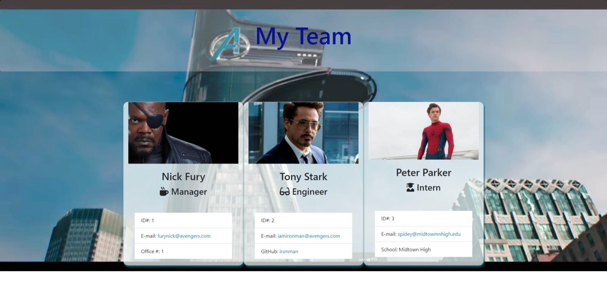

# Search Fore Golf - Project 1

[](http://unlicense.org/)

# Description:

Description of project: This project tasked me to build a Node.js command-line application that takes in information about employees on a software engineering team, then generates an HTML webpage that displays summaries for each person.  Testing was also key in making the code maintainable.

## Acceptance Criteria

* Uses [Jest](https://jestjs.io/) for running the unit test.

* Uses [Inquirer](https://www.npmjs.com/package/inquirer) for collecting input from the user.

```md
GIVEN a command-line application that accepts user input
WHEN I am prompted for my team members and their information
THEN an HTML file is generated that displays a nicely formatted team roster based on user input
WHEN I click on an email address in the HTML
THEN my default email program opens and populates the TO field of the email with the address
WHEN I click on the GitHub username
THEN that GitHub profile opens in a new tab
WHEN I start the application
THEN I am prompted to enter the team manager’s name, employee ID, email address, and office number
WHEN I enter the team manager’s name, employee ID, email address, and office number
THEN I am presented with a menu with the option to add an engineer or an intern or to finish building my team
WHEN I select the engineer option
THEN I am prompted to enter the engineer’s name, ID, email, and GitHub username, and I am taken back to the menu
WHEN I select the intern option
THEN I am prompted to enter the intern’s name, ID, email, and school, and I am taken back to the menu
WHEN I decide to finish building my team
THEN I exit the application, and the HTML is generated
```
# Test

Simply run:
```md 
npm test
```

# Screenshot




https://user-images.githubusercontent.com/82176811/129276617-ce452878-fb0e-4f89-939f-5ef9cf3f0ef9.mp4


# Resources Used

* [MDN Docs](https://developer.mozilla.org/en-US/)

* [Bootstrap Docs](https://getbootstrap.com/docs/5.0/getting-started/introduction/)

* [YouTube](https://www.youtube.com/)

# Sources

* Thanks to my instructors and TA's. Thanks to my tutor Simon Rennocks. Thaks to my classmate Jose for helping me through a CSS issue!
